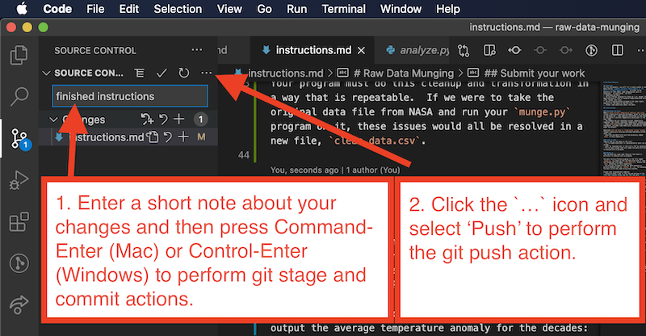

# Exam 2 Practice

Welcome! Your job is to complete all the function definitions mentioned in the problem set files such that they meet the state requirements:

- `problem_1.py`
- `problem_2.py`
- `problem_3.py`
- `problem_4.py`

To execute any of the programs, run the relevant file directly.

## ⚠️ Exam monitoring — please read before you begin

This is the **practice exam**. It is wired with the **same monitoring system as the real Exam #2** so you can confirm everything works on your computer and rehearse exam conditions before the day. Please read this section and run the autosave program below, exactly as you will be required to on the real exam.

---

On the **real exam** you **may not use generative-AI tools** (such as ChatGPT, Claude, GitHub Copilot, Cursor AI, or any other AI assistant) to write, complete, or debug your code, and **you may not share code with or copy code from anyone else**. Use this practice exam to get comfortable working under those conditions.

**Your work on this exam is monitored.** The same monitoring is active here so you can verify it runs for you:

- An **autosave program** records snapshots of your work continually while you work (see the step below). This gives a record of how your solution developed and keeps a backup of your work on a separate `autosave` branch.

- Any **AI coding activity** is logged immediately whenever an AI coding assistant makes changes to the code in the editor.

- After the exam, **submissions are analyzed** for signs of AI use, code sharing, and tampering. This analysis uses **instructor-only tools and an additional, hidden test suite that are not included in your copy of the repository** (see "What you can and cannot see," below). Anomalies are reviewed by the instructor and may be followed up with a short oral check.

### ✅ REQUIRED FIRST STEP — make sure the monitoring program is running

When you open this project in **Visual Studio Code**, the autosave program **usually starts automatically**. VS Code may ask you to "`Allow Automatic Tasks`"; choose to allow it.

A terminal panel will then show a green **“EXAM AUTOSAVE IS RUNNING”** banner.

**If you do not see that green banner** (you said no to automatic tasks, or it didn’t start for any reason), start it yourself from inside VS Code:

1. Click the **Terminal** menu at the top of VS Code, then choose **Run Task…**
2. In the list that appears, click **Exam Autosave**.

A terminal panel will open and show the green **“EXAM AUTOSAVE IS RUNNING”** banner.

_(Not using VS Code? It is required on the real exam. If you have permission to use a different editor, then double-click `Start-Exam-Autosave.command` on macOS or `Start-Exam-Autosave.bat` on Windows from Finder / File Explorer, or run `./Start-Exam-Autosave.sh` on Linux.)_

**Running this monitoring program is required**, and you must **leave that terminal open for the entire exam**. It runs a quick check and then shows the green banner with a “`Last save …`” time that updates as you work. If you ever see a **red** message, or the panel closes, your work is not being saved and you must start it again.

Do not modify the files in `.automations/`, `.cursor/`, `.claude/`, `.github/`, `.githooks/`, or `.vscode/`. Doing so will invalidate your exam.

### What you can and cannot see

For disclosure: the grading and integrity pipeline includes pieces that are **deliberately not shipped in your copy** of this repository and live only on the instructor's side:

- a **hidden test suite** (in addition to the visible tests in `tests/`) that checks edge cases the visible tests do not, so that solutions tuned only to the visible tests are caught; and
- **instructor analysis tools** that examine the autosave snapshot stream, the AI-activity log, commit history, and cross-submission similarity to triage submissions for review.

You are told these exist so the monitoring is fully disclosed; you are not expected (or able) to run them.

### ✅ REQUIRED SECOND STEP — Acknowledgement

Open [`ACKNOWLEDGEMENT.md`](ACKNOWLEDGEMENT.md), follow the one short instruction inside, and commit it. It simply confirms you have read and understood the rules above and how this exam is monitored.

---

## Clone this repository

First, clone this repository to your local computer, using Visual Studio Code's cloning feature.

Helpful video:

- [cloning a code repository from GitHub to Visual Studio Code on your local machine](https://www.youtube.com/watch?v=Xyr3cU5FhSQ&list=PL-DdwrWUDZnMCYaUqegGMPKDVJcPn-QJm&index=5).

## Set up Visual Studio Code

Once cloned, set Visual Studio Code to be suitable for Python development using the "command palette":

- set the interpreter to a Python 3.x interpreter, such as that by [`Anaconda`](https://www.anaconda.com/).
- set the linter to by `pylint`.
- set the test framework to be `pytest` using the `tests` directory.

Helpful video:

- [Setting up Visual Studio Code for Python development](https://www.youtube.com/watch?v=iYhplpI-79Y&list=PL-DdwrWUDZnMCYaUqegGMPKDVJcPn-QJm&index=4)

## Modify the code

The files named `problem_set_1.py`, `problem_set_2.py`, `problem_set_3.py`, `problem_set_4.py` contain several functions that must be completed in order for the program to work. Each function contains a description of what it should do.

The only modifications you must make in order to complete this assignment are to the functions in these files.

### Run the program

To run a program, open the **Run and Debug** panel within Visual Studio Code. When you first open this panel, it will offer an option to "`Create a launch.json file`". Click that option, it may ask what type of file you intend to run - if so, select regular `Python file`. Then, immediately close down the `launch.json` file that pops open, since it is a settings file for Visual Studio Code that we do not need to change.

Run the file named `main.py`. The code in this file makes use those functions you have modified in the other files to produce and output the text.

A best practice is to focus on one problem at a time. Comment out any lines in the `main.py` program that run parts of the code you are not interested in trying out at the moment.

Helpful video:

- [Modifying and running a Python program in Visual Studio Code](https://www.youtube.com/watch?v=itXffzwRLaE&list=PL-DdwrWUDZnMCYaUqegGMPKDVJcPn-QJm&index=3)

### Verify that the tests pass

Pytest-based tests are included in the `tests` directory that will help you determine whether each function is operating as expected. If the code has been completed correctly, all tests should pass. If not, they will fail. You should not modify any files in the `tests` directory and you should never run the test files directly.

**To run the tests**, open the **Tests** panel in Visual Studio Code and click the _Run All Tests_ button, usually represented as a "play" button icon. This will run all the tests in all the files in the `tests` directory. There are also run buttons next to each individual test that can be clicked to run specific tests. Running the tests will show which tests pass and which fail. Passing tests are generally shown with a green checkmark icon, while failing tests are shown with a red cross icon.

**If the tests pass**, this means that your code is generally correct. These automated tests cannot check the correctness of all features of your code, so you should always verify that the behavior of your program matches the requirements by running the code and trying it yourself manually.

**Note:** grading uses a more complete set of tests than the ones in `tests` — including a hidden test suite that is not included in your copy of the repository (see the "Exam monitoring" section above). Passing the provided tests does not guarantee full credit — write correct, general solutions that handle reasonable edge cases, not code tuned only to pass the visible tests.

**If the tests fail**, this means there are errors/mistakes in your solution. For those tests that fail, clicking on the test will show an _AssertionError_ message that may be helpful identifying where the error is in your code.

**If the tests never load**, most likely there are major errors in your code that prevent it from working. The tests will not work if your code does not run, so always try running your code first. You can find out why the tests don’t load by opening Visual Studio Code’s **Terminal** panel and running the command `pytest --collect-only` (If your computer says the command, `pytest` is not found, try installing it with `pip install pytest` or `pip3 install pytest`. Then try running it again. If it still says `pytest` is not found, try `python -m pytest --collect-only` instead). This will show error messages explaining why the tests did not load correctly.

- If the command above doesn't show any erorrs yet the editor still doesn't load the tests, you can run the tests entirely from the **Terminal** with the `pytest` command.
- If the command above doesn't show any error and the tests still don't load you can also try to delete any directories in the project named `__pycache__`, `.pytest_cache` and `tests/__pycache__`, close down your code editor window, open it again, and try running the tests again. If that still fails, try running the tests from the **Terminal** with the `pytest` command as indicated above.
- If error messages that show up when running the `pytest --collect-only` command indicate an error in your code files, fix those errors and try to load the tests again. A common error is, "`reading from stdin while output is captured!`" - this is always due to incorrect indentation of your code, where code that is meant to be nested within a function is, in fact, not indented beneath the function definition line and thus not considered by Python to be part of that functino.

**If, for whatever reason, you are not able to get the tests to load**, this should not stop you from completing the work. Carry on and make sure your programs perform as expected the “old fashioned way” - verify they behave correctly yourself by running them and trying them out. In most cases, the instructions are clear and following them exactly will result in a correct program.

Helpful video:

- [Running unit tests in Visual Studio Code](https://www.youtube.com/watch?v=FCICe3Tua2g&list=PL-DdwrWUDZnMCYaUqegGMPKDVJcPn-QJm&index=2)

## Submit your work

Each student must submit this assignment individually. Use Visual Studio Code to perform git `stage`, `commit` and `push` actions to submit. These actions are all available as menu items in Visual Studio Code's Source Control panel.

1. Type a short note about what you have done to the files in the `Message` area, and then type `Command-Enter` (Mac) or `Control-Enter` (Windows) to perform git `stage` and `commit` actions.
1. Click the `...` icon next to the words, "`Source Control"` and select "Push" to perform the git `push` action. This will upload your work to your repository on GitHub.com.

Helpful video:

- [Submitting work from Visual Studio Code to GitHub](https://www.youtube.com/watch?v=ePIOee1D8Js&list=PL-DdwrWUDZnMCYaUqegGMPKDVJcPn-QJm&index=1)
